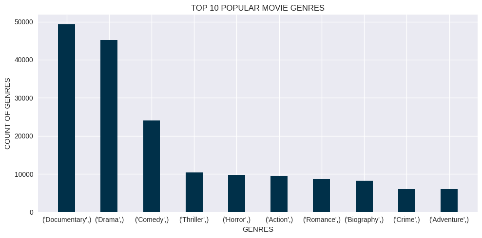
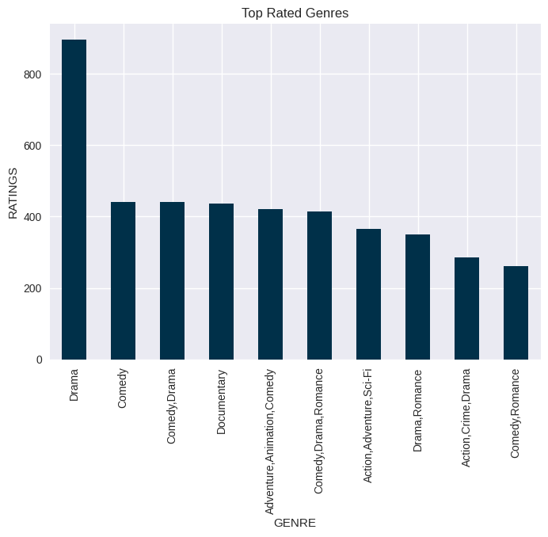
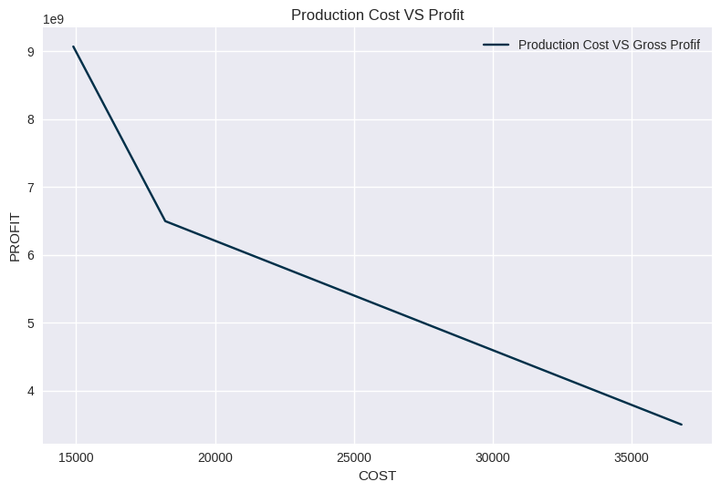
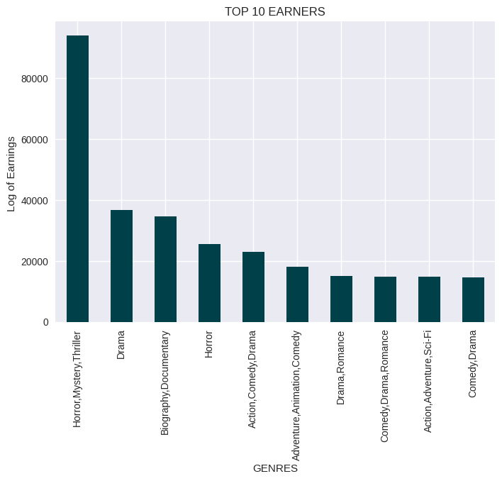

# Microsoft Movie GENRE Analysis

# INTRODUCTION
This projects is aimed at performing an analysis for Microsoft with a view to advise the company in what type of Movies to invest in as they venture into movie production. The analysis explores data provided, but pays emphasis on data that have relationship to movie genres as the focus of the analysis revolves around "types of films". The objective is to analyse the data with enough visualizations and make recommendations to the company

## BUSINESS QUESTIONS

As stated in the above we are charged with exploring what types of films are currently doing the best at the box office.

In this regards we have formulated the following questions that will aid in delivering that mandate:

i. What are the most popular genres?

ii: What are the most profitable genres to invest in?

iii:What Genres Has the Highest Ratings?

iv. What Genres have the highest Gross Profit

### Requirements

1.Import the required libraries:

We shall import several Python libraries to aid in performing the task. Pandas and Numpy for data inspection, exploration, and management; Matplolib and seasbon for creation of visualisations

2.Explore Data and Perform Data Cleaning

We shall attempt to clean data as much as possible in order to generate precise output and avoid errors as well as make it posssible to create visualisation.

The cleaned data shall be used to answer the business questions listed.

## INTRODUTION 
•	project is aimed at performing an analysis for Microsoft
•	Review of data with aim to advise the company as it venture into movie production.
•	The analysis explores data provided to advise on types of Movies to invest in 
•	Analysis pays emphasis on data that have relationship to movie genres
•	Answers and recommendations focused around "types of films“
•	The recommendation puts three factors into consideration; Popularity, Profitability  and Cost of production

## OBSERVATIONS
### MOST POPULAR MOVIES

There are three deliverables for this project:

•	Documentaries had the highest population in the dataset. 
•	It is inferred that they are the most popular genre
•	A close second place was take by drama (24,014)
•	Third place was take by comedies’
•	Others in the top ten favorites  included  Thriller, Horror, Action, Romance, Biography Crime and Adventure

### POPULARITY BY RATING

•	DRAMAS HAVE THE HIGHEST RATINGS 
•	It is DEDUCED  that they are the most popular genre
•	A close second place was taken by COMEDY
•	other top ten favorites  include Adventure, animation and action

### MOST profitable movies genres to make  

•	A blend of Horror/mystery/thrillers had the highest the highest percentage profit
•	this category had Percentage Profits up to 90,000 per cent. 
•	Dramas and documentaries/biographies came in second and third respectively 
•	The two categories were profitable with percentage profits in the upwards of 30,000. 
•	Horror as a category of their own came in fifth, indicating that horrors are a top earner. 
•	Similarly, drama appeared again at 6th category indicating it is lucrative 

### Production cost vs percentage profit  

•	Data showed most profitable genres compared to the most expensive to produce
•	Horror/mystery/thrillers category is missing amongst the high production cost category 
•	Drama feature in both but in relatively low numbers 
•	Dramas are a safe bet medium cost and medium returns 
•	adventure/animation/comedy had both high returns but also had high production cost
•	Action movies have high production cost with feasible percentage profits 

## Recommendations

1.	THE company should prioritize production of drama movies
    •	Amongst most popular genre
    •	Have low cost of production
    •	Have relatively high returns on investment

2.	TOP Genres to invest in include adventure/animation/comedy. Despite the high production cost they had some of the highest returns and were as well popular. 

3.	For diversity, the company could invest in action, adventure, comedies, documentaries and romance 

